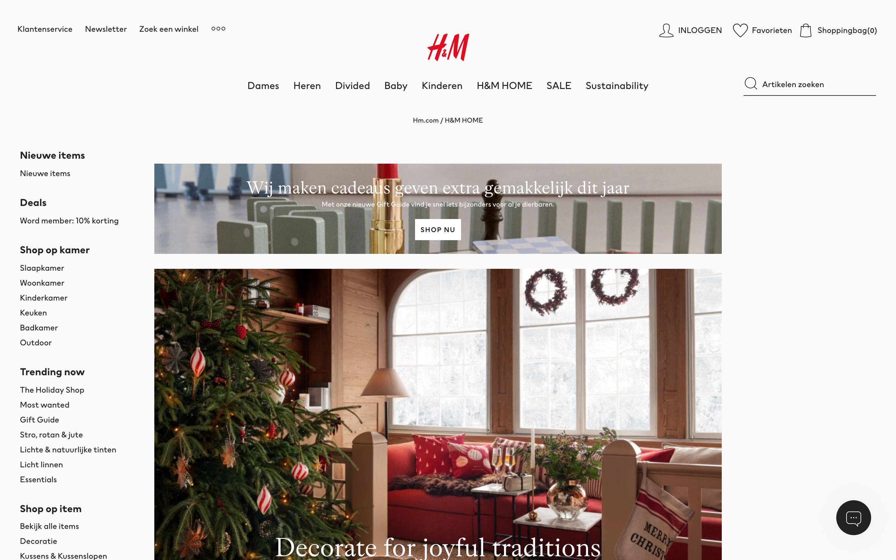
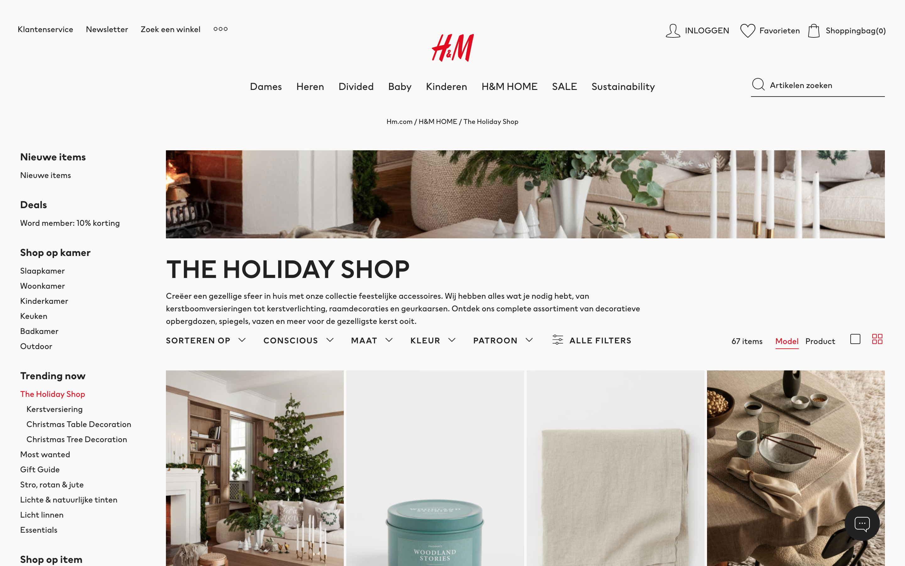
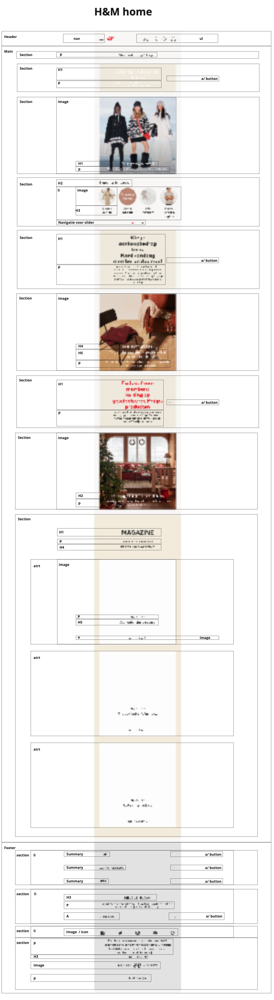
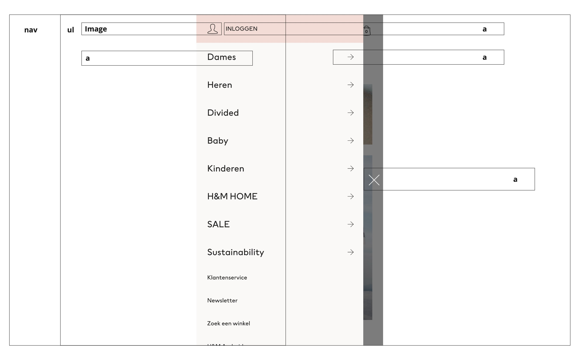
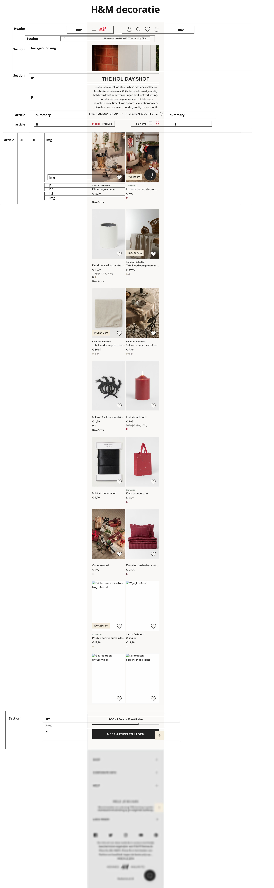
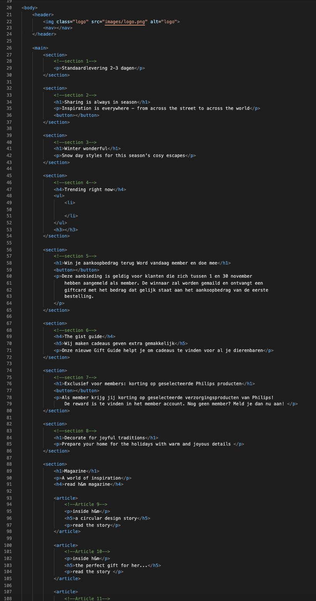
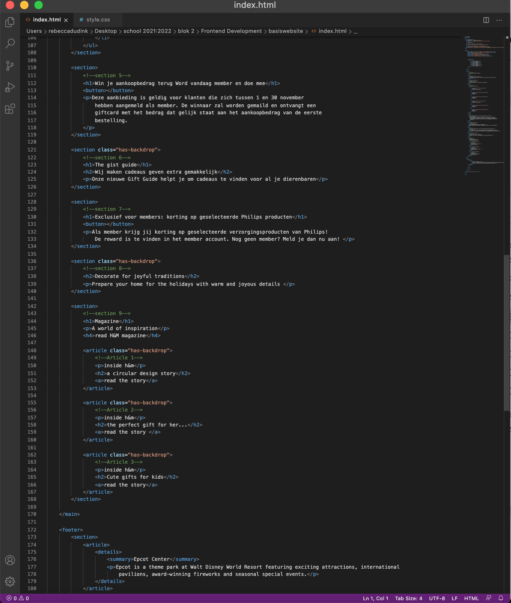
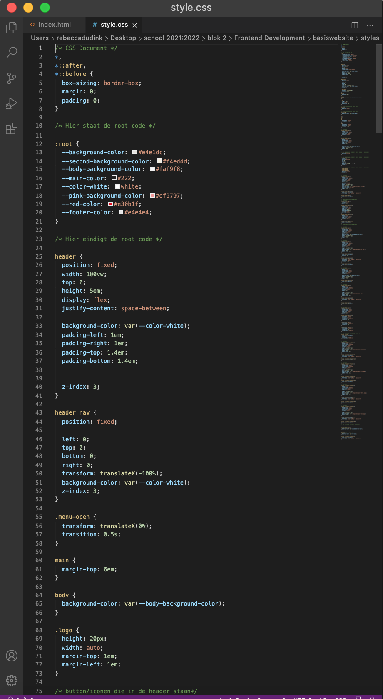
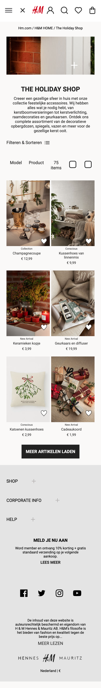
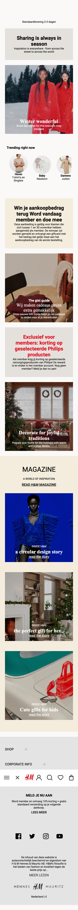

# Procesverslag
Markdown is een simpele manier om HTML te schrijven.  
Markdown cheat cheet: [Hulp bij het schrijven van Markdown](https://github.com/adam-p/markdown-here/wiki/Markdown-Cheatsheet).

Nb. De standaardstructuur en de spartaanse opmaak van de README.md zijn helemaal prima. Het gaat om de inhoud van je procesverslag. Besteedt de tijd voor pracht en praal aan je website.

Nb. Door *open* toe te voegen aan een *details* element kun je deze standaard open zetten. Fijn om dat steeds voor de relevante stuk(ken) te doen.

## Jij

uitwerken voor kick-off werkgroep

### Auteur:
Rebecca Dudink

#### Je startniveau:
blauw

#### Je focus:
surface plane
 

## Je website

uitwerken voor kick-off werkgroep

### Je opdracht:
https://www2.hm.com/nl_nl/index.html

#### Screenshot(s) van de eerste pagina (small screen): 
Hm home pagina

#### Screenshot(s) van de tweede pagina (small screen):
Hm the holiday shop  

 

## Breakdownschets (week 1)

uitwerken na afloop 2e werkgroep

### de hele pagina: 

### dynamisch deel (bijv menu): 

### wellicht nog een dynamisch deel (bijv filter): 

## Voortgang 1 (week 2)

uitwerken voor 1e voortgang

### Stand van zaken
hier dit ging goed & dit was lastig (neem ook screenshots op van delen van je website en code)

### Agenda voor meeting
samen met je groepje opstellen

 Rebecca:hoe ik het beste een logo in de header zet zonder class, p en h1 in een section kan aanpassen,waarom de pagina niet verder wilt scrollen
 
 Beyza: -
 
 Isabelle van Huystee: een img over een img kan zetten, indeling maken verschillende buttons
 
 Daan Honing:hoe animatie infade op website

### Verslag van meeting
In deze meeting werdt aan me uitgelegt hoe ik het beste een section kon vormgeven en hoe ik hierbij een afbeelding onder de tekst kon zetten.
 

## Voortgang 2 (week 3)

uitwerken voor 2e voortgang

### Stand van zaken
hier dit ging goed & dit was lastig (neem ook screenshots op van delen van je website en code)
 

 

 

### Agenda voor meeting
samen met je groepje opstellen

Rebecca:In de footer staat een section met een article er in alleen hier komt een afbeelding in te staan want op de zelfde manier wordt die section en article gebruikt bij section 9 article 1 en hoe laat ik het menu weer sluiten. 
 
 Beyza: -
 
 Isabelle van Huystee: hoe maak ik een boxshadow bij de button, hoe kan ik het beste uitklappen hamburger menu maken en waarom schaalt deze niet mee naar center als ik wel hetzelfde heb gecodeerd - regel 205
 
 Daan Honing:Hoe kan ik mijn menu button laten animeren? , hoe kan er voorzorgen dat de menu knop bovenaan staat

### Verslag van meeting
Ik kreeg tips hoe ik verschillende sections kon vormgeven zonder de andere aan te passen dit kon ik doen met een nth-of-type. 

## Toegankelijkheidstest (week 4)

uitwerken na test in 8e voortgang

### Bevindingen
Lijst met je bevindingen die in de test naar voren kwamen:
 - voice over
 - door de website tabben
 

#### Voice-over
De voice-over vertelde niet de h1, h2 en de p tekst. Daarnaast slaat hij de afbeeldingen over omdat deze een achtergrond afbeelding is voor het article. Het logo sloeg hij ook over. 
 
 
Hier een omschrijving van hoe het opgelost kan worden (met indien nodig een afbeelding)
De afbeeldingen kan je oplossen door er geen achtergrond afbeelding van te maken maar het gewoon als img tag in de html te zetten. 

#### Tabben 
Je kan helemaal door het menu tabben en ook door de footer maar in de main doet hij een beetje raar bij de content want hij laat niet zien waar hij is. 
 
Hier een omschrijving van hoe het opgelost kan worden (met indien nodig een afbeelding)
Ik heb eerlijk gezegd geen idee hoe ik dit zou kunnen oplossen.

#### Verschillende brillen. 
ik heb mijn website bekeken met verschillende brillen. De ene liet het kleur verschil zien er kwam een gele gloed over de website maar alles was nog wel goed te lezen. Daarnaast hadden we een bril die je zicht beperkte waardoor je aan de zijkant niks zou zien, met deze bril kon ik ook nog goed de website bekijken. Dan de laatse bril maakte het zicht wazig. Deze bril maakte het moeilijk om de website te bekijken. Dit zou opgelost kunnen worden door de knoppen en teksten groter te maken.

#### Slechte motoriek. 
Om te kijken of de website geschikt is voor mensen met een slechtere motoriek kregen we een shok apparaat om die parkinson kon namaken, we kregen schokken zodat je begon te trillen. Tijdens deze testen kwam ik er achter dat de knoppen een goed formaat hadden maar dat de linkjes wel wat groter konden zijn. 

## Voortgang 3 (week 4)

uitwerken voor 3e voortgang

### Stand van zaken
hier dit ging goed & dit was lastig (neem ook screenshots op van delen van je website en code)

### Agenda voor meeting
samen met je groepje opstellen

rebecca:
hoe sluit ik het filter menu, waarom doet mijn lees meer button het niet, hoe kan ik het hartje van kleur laten veranderen en of ik ook 5 verschillende surface plane heb.
 
 Daan:
 heeft geen vragen
 
 Isabelle:
 of ik 5 verschillende surface plane onderdelen heb

### Verslag van meeting
hier na afloop snel de uitkomsten van de meeting vastleggen

Ik ben geholpen met het verbeteren van de filteren en sorteren menu 

## Eindgesprek (week 5)

uitwerken voor eindgesprek

### Stand van zaken
Ik vond het in het begin wel lastig om te bedenken hoe ik alles in elkaar mooest zetten maar eigenlijk werdt dit een stuk makkelijker toen we de breakdown schetsen moesten maken. Ook vond ik het moeilijk om te werken met javascript en sommige huiswerk opdrachten te maken. Ik ben heel erg blij met het eindresultaat en ook trots dat ik tot dit eindresultaat ben gekomen.

### Screenshot(s)

hier screenshot(s) van je eindresultaat

## Bronnenlijst

continu bijhouden terwijl je werkt

Nb. Wees specifiek ('css-tricks' als bron is bijv. niet specifiek genoeg).
 
 Text shadow:

[https://css3gen.com/text-shadow/](https://css3gen.com/text-shadow/) 
 
  Flex box:
[https://css-tricks.com/snippets/css/a-guide-to-flexbox/](https://css-tricks.com/snippets/css/a-guide-to-flexbox/)

 Css gardient
[https://cssgradient.io/](https://cssgradient.io/)
 
nth of type:
[https://css-tricks.com/the-difference-between-nth-child-and-nth-of-type/](https://css-tricks.com/the-difference-between-nth-child-and-nth-of-type/)
 
Line height:
 [https://www.w3schools.com/cssref/pr_dim_line-height.asp](https://www.w3schools.com/cssref/pr_dim_line-height.asp)

 
 Summary tags:
[https://www.w3schools.com/tags/tag_summary.asp](https://www.w3schools.com/tags/tag_summary.asp)

Box shadow:
[https://www.w3schools.com/cssref/css3_pr_box-shadow.asp](https://www.w3schools.com/cssref/css3_pr_box-shadow.asp)

 
 Line height:
[https://www.w3schools.com/cssref/tryit.asp?filename=trycss3_box-shadow](https://www.w3schools.com/cssref/tryit.asp?filename=trycss3_box-shadow)

